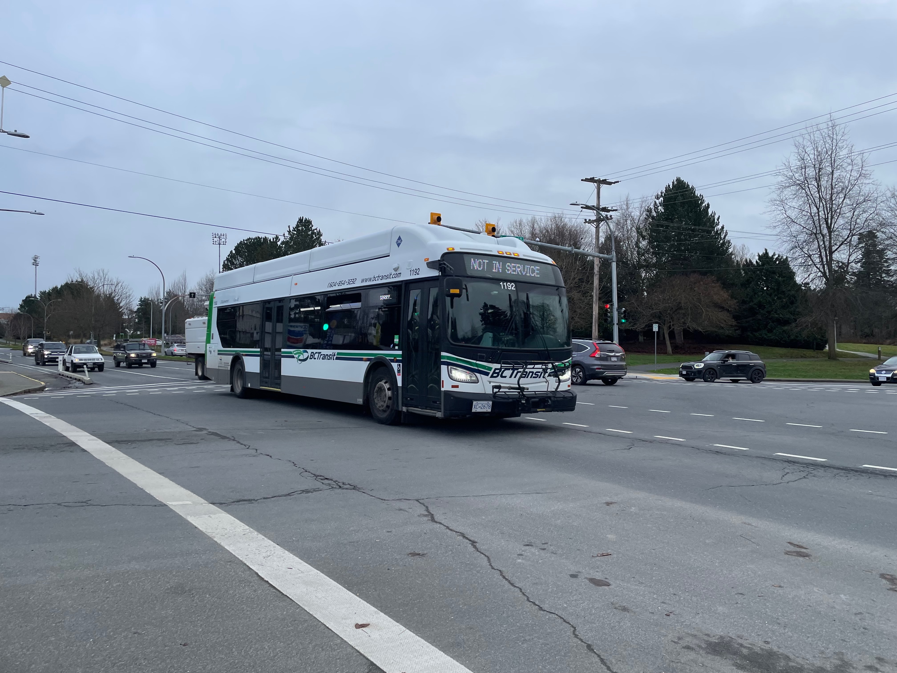

A curated collection of BC Transit Victoria vehicle photographs.

- [Fleet Numbers](#fleet-numbers)
  - [1. 1152/1155/1157-1161/1163-1185](#1-115211551157-11611163-1185)
  - [2. 1186-1192](#2-1186-1192)
  - [3. 1223-1232](#3-1223-1232)
  - [4. 1233-1253](#4-1233-1253)
  - [5. 1256/1258](#5-12561258)
  - [6. 1274-1277](#6-1274-1277)
  - [7. 4200-4214/4216-4224](#7-4200-42144216-4224)
  - [8. 4234-4248](#8-4234-4248)
  - [9. 7500-7524](#9-7500-7524)
  - [10. 9047(Retired 2025)](#10-9047retired-2025)
  - [11. 9287](#11-9287)
  - [12. 9303/9308/9310/9312/9314](#12-93039308931093129314)
  - [13. 9332-9335/9339/9342/9345/9347/9355-9360/9362-9366/9368-9372/9375-9379/9381-9385/9387-9388/9390-9395/9398-9399/9403-9415/9417-9422/9424-9426/9428/9431-9433](#13-9332-933593399342934593479355-93609362-93669368-93729375-93799381-93859387-93889390-93959398-93999403-94159417-94229424-942694289431-9433)
  - [14. 9434 (Santa bus in 2025)(Smart bus)](#14-9434-santa-bus-in-2025smart-bus)
  - [15. 9435-9446](#15-9435-9446)
  - [16. 9452-9453/9455-9458/9460-9477/9480-9481/9483-9486](#16-9452-94539455-94589460-94779480-94819483-9486)
  - [17. 9501-9506/9508-9522/9524-9526](#17-9501-95069508-95229524-9526)
  - [18. 9528](#18-9528)
  - [19. 9529-9531](#19-9529-9531)
  - [20 9532-9542](#20-9532-9542)
  - [21. 9543-9550](#21-9543-9550)
  - [22. 9551-9589](#22-9551-9589)
- [HandyDART bus of BC Transit](#handydart-bus-of-bc-transit)
  - [1. 2692/2694-2696.2698-2700/2718-2719/2722](#1-26922694-26962698-27002718-27192722)
  - [2. 2757-2762/2764-2772](#2-2757-27622764-2772)
  - [3. 2787-2790](#3-2787-2790)
  - [4. 2839,2851](#4-28392851)
  - [5. 2868-2869/2883-2886/2891-2895](#5-2868-28692883-28862891-2895)
  - [6. 2911-2912/2916-2919/2925-2928](#6-2911-29122916-29192925-2928)
  - [7. 3278-3290/3301](#7-3278-32903301)

## Fleet Numbers

### 1. 1152/1155/1157-1161/1163-1185

**Year:** 2019
**Manufacturer:** New flyer

### 2. 1186-1192

**Year:** 2020
**Manufacturer:** New flyer

### 3. 1223-1232

**Year:** 2021
**Manufacturer:** New flyer

### 4. 1233-1253

**Year:** 2022
**Manufacturer:** New flyer

### 5. 1256/1258

**Year:** 2024
**Manufacturer:** New flyer

### 6. 1274-1277

**Year:** 2025
**Manufacturer:** New flyer

### 7. 4200-4214/4216-4224

**Year:** 2020
**Manufacturer:** Grande West

### 8. 4234-4248

**Year:** 2022
**Manufacturer:** VMC

### 9. 7500-7524

**Year:** 2025
**Manufacturer:** NFI

### 10. 9047(Retired 2025)

### 11. 9287

**Year:** 2008
**Manufacturer:** Nova Bus

### 12. 9303/9308/9310/9312/9314

**Year:** 2008
**Manufacturer:** Nova Bus

### 13. 9332-9335/9339/9342/9345/9347/9355-9360/9362-9366/9368-9372/9375-9379/9381-9385/9387-9388/9390-9395/9398-9399/9403-9415/9417-9422/9424-9426/9428/9431-9433

**Year:** 2009
**Manufacturer:** Nova Bus

### 14. 9434 (Santa bus in 2025)(Smart bus)

**Year:** 2012 
**Manufacturer:** Nova Bus

### 15. 9435-9446

**Year:** 2013 
**Manufacturer:** Nova bus

### 16. 9452-9453/9455-9458/9460-9477/9480-9481/9483-9486

**Year:** 2015
**Manufacturer:** Nova bus

### 17. 9501-9506/9508-9522/9524-9526

**Year:** 2008
**Manufacturer:** Alexander Dennis

### 18. 9528

**Year:** 2007
**Manufacturer:** Alexander Dennis

### 19. 9529-9531

**Year:** 2008
**Manufacturer:** Alexander Dennis

### 20 9532-9542

**Year:** 2020
**Manufacturer:** Alexander Dennis

### 21. 9543-9550

**Year:** 2021
**Manufacturer:** Alexander Dennis

### 22. 9551-9589

**Year:** 2025
**Manufacturer:** Alexander Dennis

## HandyDART bus of BC Transit

### 1. 2692/2694-2696.2698-2700/2718-2719/2722

**Year:** 2020

### 2. 2757-2762/2764-2772

**Year:** 2021

### 3. 2787-2790

**Year:** 2021

### 4. 2839,2851

**Year:** 2022

### 5. 2868-2869/2883-2886/2891-2895

**Year:** 2023

### 6. 2911-2912/2916-2919/2925-2928

**Year:** 2024

### 7. 3278-3290/3301

**Year:** 2024/2025

